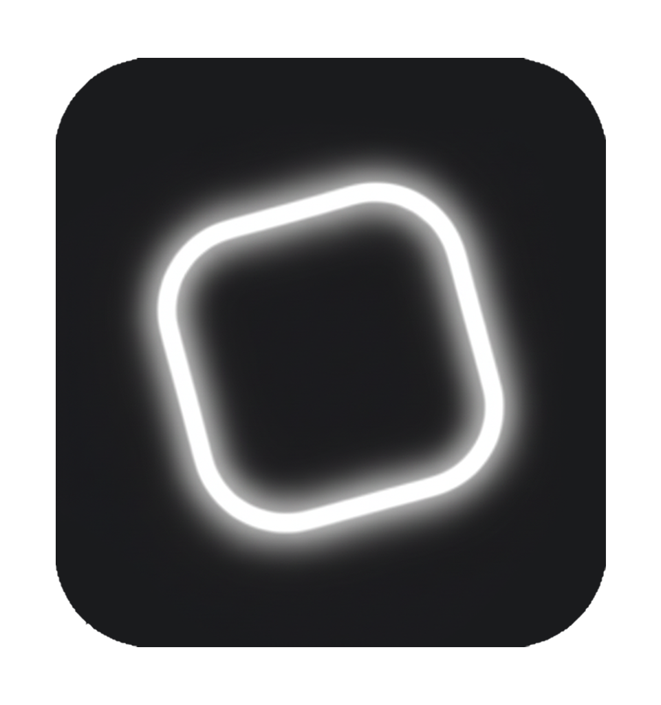
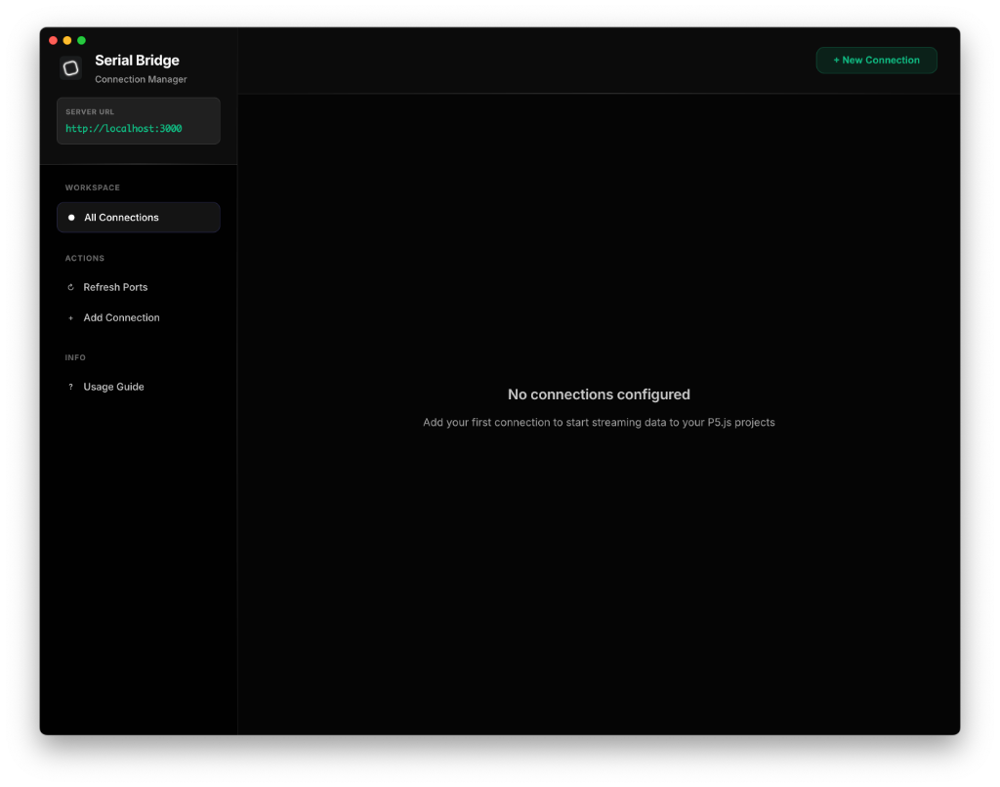
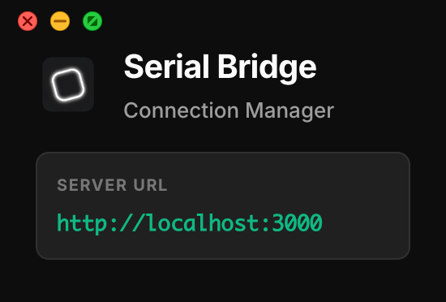

<p align="center">
  
</p>

<h1 align="center">Serial Bridge</h1>

<p align="center"> A desktop application that creates a bridge between serial devices (Arduino, microcontrollers) and web-based creative coding environments like P5.js. Connect multiple devices simultaneously and access their serial data through a simple JavaScript API.</p>


## Table of Contents

- [Features](#features)
- [Installation](#installation)
  - [Download Pre-built Application](#download-pre-built-application)
  - [macOS Installation](#-macos-installation)
  - [Build from Source](#build-from-source)
- [Quick Start](#quick-start)
- [API Reference](#api-reference)
  - [Basic Usage](#basic-usage-most-common)
  - [Advanced Usage](#advanced-usage-optional)
- [Examples](#examples)
- [Configuration](#configuration)
- [Troubleshooting](#troubleshooting)
- [Contributing](#contributing)
- [License](#license)
- [Support](#support)


## Features

- **Multiple Arduino Support**: Connect and manage multiple Arduino boards simultaneously
- **Real-time Data Streaming**: Stream sensor data to your P5.js sketches in real-time
- **Simple API**: Clean, beginner-friendly JavaScript client library
- **Cross-Platform**: Works on macOS, Windows, and Linux
- **WebSocket Communication**: Low-latency bidirectional communication
- **Editable Connection IDs**: Customize connection identifiers for better project organization
  

  


## Why Serial Bridge?

While the **Web Serial API** is a great tool, **Serial Bridge** offers several distinct advantages for creative coding and installation work:

| Feature | Web Serial API | Serial Bridge |
|---------|---------------|---------------|
| **Browser Support** | Chrome/Edge only | **All Browsers** (Chrome, Firefox, Safari) |
| **Connection Persistence** | Disconnects on page refresh | **Stays Connected** (Refresh page without losing connection) |
| **User Experience** | Permission prompt on every visit | **Connect Once**, use everywhere |
| **Multiple Devices** | Complex to manage in code | **Easy** (Manage via UI, access by ID) |
| **Security Context** | Requires HTTPS | Works on **localhost** & HTTPS |

**Key Advantage:** With Serial Bridge, your P5.js sketch doesn't need complex connection logic. You just listen for data. This makes it perfect for:
- Classrooms and workshops (easier for beginners)
- Permanent installations (more robust reconnection)
- Rapid prototyping (refresh your sketch instantly without reconnecting hardware)

## Installation

### Download Pre-built Application

Download the latest release for your platform from the [Releases page](https://github.com/IrtizaNasar/SerialBridge/releases).

### Build from Source - For Advanced Users

```bash
# Clone the repository
git clone https://github.com/IrtizaNasar/SerialBridge.git
cd SerialBridge

# Install dependencies
npm install

# Run in development mode
npm start

# Build for production
npm run build
```

## Quick Start

### 1. Connect Your Arduino

1. Launch the Serial Bridge application
2. Click "New Connection" to add an Arduino
3. Select your Arduino's port from the dropdown
4. Click "Connect"

> [!TIP]
> **Identifying Your Board (Windows)**: On Windows, boards often appear as generic "USB Serial Device". The port list shows the Vendor ID (VID) and Product ID (PID) to help you identify them (e.g., `2341:0043`).
> - `2341` is the code for **Arduino SA**.
> - `0043` is the code for an **Arduino Uno**.

### 2. Upload Arduino Sketch

Upload this basic sketch to your Arduino:

```cpp
void setup() {
  Serial.begin(9600);
}

void loop() {
  int sensorValue = analogRead(A0);
  Serial.println(sensorValue);
  delay(50);
}
```

### 3. Create Your P5.js Project

> [!TIP]
> **Quick Setup**: Use the [p5.js Project Generator](https://marketplace.visualstudio.com/items?itemName=Irti.p5js-project-generator) VS Code extension to instantly generate a P5.js 2.0 project structure.

Include the client library in your HTML:

```html
<!DOCTYPE html>
<html>
<head>
  <script src="https://cdn.jsdelivr.net/npm/p5@2.1.1/lib/p5.min.js"></script>
  <script src="http://localhost:3000/socket.io/socket.io.js"></script>
  <!-- LOADED FROM THE SERIAL BRIDGEAPP: You do NOT need this file    <!-- Serial Bridge Client Library -->
    <script src="http://localhost:3000/serial-bridge.js"></script>
  <script src="sketch.js"></script>
</head>
<body></body>
</html>
```

> [!IMPORTANT]
> The `serial-bridge.js` script is served **dynamically** by the Serial Bridge application. **You do NOT need to download or copy this file.** Just ensure the app is running and the port matches.

**Note:** The Socket.IO URL should match your bridge server port (default: 3000). The active server URL is displayed in the Serial Bridge application sidebar under "Server URL".




Create your sketch:

```javascript
let bridge;
let sensorValue = 0;

function setup() {
  createCanvas(400, 400);

  // Connect to Serial Bridge
    bridge = new SerialBridge(); // Auto-detects URL from socket.io script
    // OR: bridge = new SerialBridge('http://localhost:3000');

  // Listen for data from arduino_1
  bridge.onData('arduino_1', (data) => {
    sensorValue = parseInt(data);
  });
}

function draw() {
  background(220);

  // Visualize the sensor data
  let h = map(sensorValue, 0, 1023, 0, height);
  rect(width/2 - 25, height - h, 50, h);

  text(`Value: ${sensorValue}`, 10, 20);
}
```


## API Reference

### Basic Usage (Most Common)

For most users, you'll only need these methods. The Serial Bridge desktop app handles all connection management through its UI.

#### SerialBridge Constructor

Create a new bridge connection:

```javascript
const bridge = new SerialBridge(serverUrl);
// URL is auto-detected from Socket.IO script tag

// Or specify a custom URL if needed:
const bridge = new SerialBridge('http://localhost:3001');
```

**Parameters:**
- `serverUrl` (string, optional): Bridge server URL. Auto-detects if not provided.

#### `onData(arduinoId, callback)`

Receive data from an Arduino connected via the desktop app.

```javascript
bridge.onData('arduino_1', (data) => {
  console.log('Received:', data);
});
```

**Parameters:**
- `arduinoId` (string): The Arduino connection ID (e.g., 'arduino_1')
- `callback` (function): Function called when data is received

#### `onStatus(arduinoId, callback)`

Monitor connection status changes.

```javascript
bridge.onStatus('arduino_1', (status, port) => {
  console.log(`Status: ${status}, Port: ${port}`);
});
```

**Parameters:**
- `arduinoId` (string): The Arduino connection ID
- `callback` (function): Function called when status changes

#### `send(arduinoId, data)`

Send data to a connected Arduino.

```javascript
await bridge.send('arduino_1', 'TOGGLE_LED');
```

**Parameters:**
- `arduinoId` (string): The Arduino connection ID
- `data` (string): Data to send

**Returns:** Promise

#### Wildcard Listeners

Listen to all Arduino connections using `'*'`:

```javascript
bridge.onData('*', (data, id) => {
  console.log(`${id} sent: ${data}`);
});

bridge.onStatus('*', (status, port, id) => {
  console.log(`${id} is ${status}`);
});
```

---

## Advanced Usage (Optional)

**Note:** The Serial Bridge desktop app must still be running for these methods to work. These methods allow you to manage connections programmatically instead of using the desktop app's UI.

### When to Use Advanced Methods

Use these if you want to:
- Build custom web interfaces for connection management
- Create automated systems that connect without user interaction
- Develop custom dashboards or teaching tools

### Advanced Methods

#### `getPorts()`

Get list of available serial ports programmatically.

```javascript
const ports = await bridge.getPorts();
console.log(ports);
```

**Returns:** Promise<object>

#### `connectArduino(arduinoId, portPath, baudRate)`

Connect to an Arduino without using the desktop app UI.

```javascript
await bridge.connectArduino('arduino_1', '/dev/cu.usbmodem14101', 9600);
```

**Parameters:**
- `arduinoId` (string): The Arduino connection ID
- `portPath` (string): Serial port path
- `baudRate` (number, optional): Baud rate. Default: 9600

**Returns:** Promise

#### `disconnectArduino(arduinoId)`

Disconnect from an Arduino programmatically.

```javascript
await bridge.disconnectArduino('arduino_1');
```

**Parameters:**
- `arduinoId` (string): The Arduino connection ID

**Returns:** Promise

## Examples

The `examples/` directory contains complete working examples:

- **basic-p5js**: Simple data visualization with bar chart and line graph
- **arduino-sketches**: Example Arduino sketches
  - `basic-sensor.ino`: Read and send analog sensor data
  - `interactive-led.ino`: Bidirectional communication with LED control

See [examples/README.md](examples/README.md) for detailed documentation.

## Project Structure

```
SerialBridge/
├── main.js                 # Electron main process
├── public/                 # Bridge application UI
│   ├── index.html
│   ├── styles.css
│   ├── client.js
│   └── arduino-bridge.js   # Client library for P5.js
├── examples/               # Example projects
│   ├── basic-p5js/
│   └── arduino-sketches/
└── assets/                 # Application icons
```

## Configuration

### Baud Rate

The default baud rate is 9600. To use a different rate:

```javascript
// In your Arduino sketch
Serial.begin(115200);

// When connecting programmatically
await bridge.connectArduino('arduino_1', '/dev/cu.usbmodem14101', 115200);
```

### Server Port

The bridge server runs on port 3000 by default. If port 3000 is already in use, the application will automatically try ports 3001-3004.

**The active server URL is always displayed in the application sidebar** under "Server URL". Use this URL when including Socket.IO in your P5.js projects.

To change the default starting port, modify `serverPort` in `main.js`:

```javascript
let serverPort = 3000; // Change this to your preferred starting port
```

## Troubleshooting

### Connection Issues

**Problem**: Cannot connect to Arduino
- Verify the Arduino is plugged in via USB
- Check that no other application is using the serial port (close Arduino IDE Serial Monitor)
- Try refreshing the port list
- Restart the Serial Bridge application

**Problem**: Data appears corrupted
- Ensure baud rates match between Arduino and Bridge (default: 9600)
- Use `Serial.println()` not `Serial.print()` in Arduino sketches
- Verify data is sent as simple text or numbers

### P5.js Integration Issues

**Problem**: Bridge connection fails in P5.js
- Verify Serial Bridge application is running
- Check the sidebar in the Bridge app for the server URL (e.g., "http://localhost:3001")
- Update the Socket.IO script URL to match: `<script src="http://localhost:3001/socket.io/socket.io.js"></script>`
- The `SerialBridge()` constructor will auto-detect the URL from the Socket.IO script
- Include socket.io client library before arduino-bridge.js
- Check browser console for error messages

**Problem**: No data received
- Verify Arduino is connected in the Bridge app (green status indicator)
- Check Arduino ID matches (case-sensitive)
- Test with Arduino IDE Serial Monitor first

## Contributing

Contributions are welcome! This project aims to be beginner-friendly and well-documented.

### Development Setup

```bash
git clone https://github.com/IrtizaNasar/SerialBridge.git
cd SerialBridge
npm install
npm start
```

### Code Style

- Write clear, simple code that beginners can understand
- Add comments explaining non-obvious logic
- Follow existing code formatting
- Test with multiple Arduinos when possible

### Submitting Changes

1. Fork the repository
2. Create a feature branch (`git checkout -b feature/amazing-feature`)
3. Commit your changes (`git commit -m 'Add amazing feature'`)
4. Push to the branch (`git push origin feature/amazing-feature`)
5. Open a Pull Request

## License

MIT License - see [LICENSE](LICENSE) file for details

## Credits

Built with:
- [Electron](https://www.electronjs.org/) - Desktop application framework
- [Express](https://expressjs.com/) - Web server
- [Socket.IO](https://socket.io/) - WebSocket communication
- [SerialPort](https://serialport.io/) - Serial port access

Designed for use with [P5.js](https://p5js.org/) - a friendly tool for learning to code and make art.

## Support

- **Documentation**: [examples/README.md](examples/README.md)
- **Issues**: [GitHub Issues](https://github.com/IrtizaNasar/SerialBridge/issues)
- **Discussions**: [GitHub Discussions](https://github.com/IrtizaNasar/SerialBridge/discussions)
