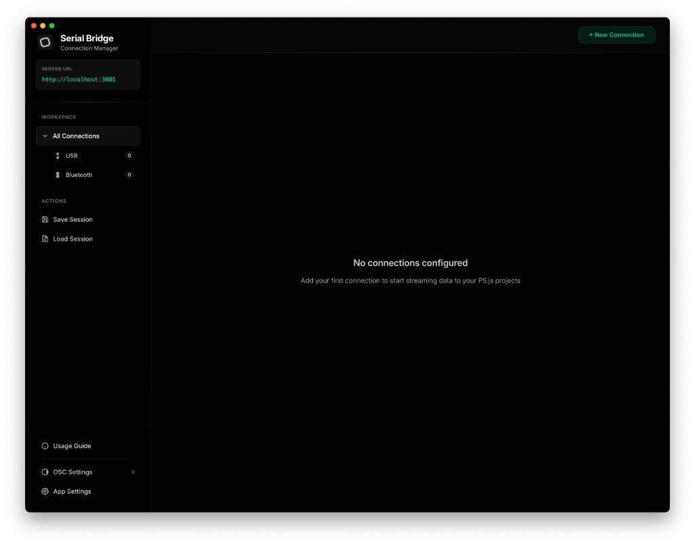
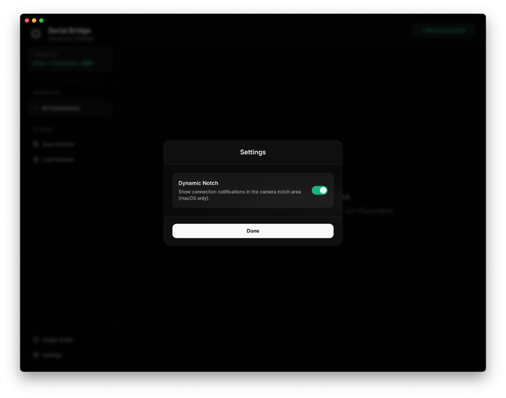

<p align="center">
  
</p>

<h1 align="center">Serial Bridge</h1>

<p align="center"> A desktop application that bridges <b>USB and Bluetooth</b> devices to web-based creative coding environments. Connect multiple devices simultaneously, access their data through a simple JavaScript API, or <b>broadcast via OSC</b> to any compatible software.</p>

<p align="center">
  <a href="LICENSE">
    
  </a>
</p>




<p align="center">
  <a href="https://www.buymeacoffee.com/irti">
    
  </a>
  <br>
  <b>Support the Project</b>
</p>
<br>

## What's New in V2.0

- **Bluetooth Low Energy (BLE) Support**: Native support for Arduino Uno R4 WiFi, Nano 33 BLE, and ESP32.
- **Device Profiles**: Built-in support for complex devices like the **Muse 2** and **Muse S (Athena)** EEG headbands, **Bluetooth Heart Rate Monitors** (Whoop, Polar, etc.), and **iPhone (via Sensor Bridge App)** for accessing phone sensors.
- **Session Management**: Save and load your entire workspace configuration.
- **Data Smoothing API**: Built-in `smooth()`, `stable()`, and `kalman()` filters.
- **Improved UI**: Drag-and-drop reordering, editable connection IDs, and real-time connection filtering.
- **Smart Error Handling**: Intelligent detection of connection errors (USB & **Bluetooth**) with clear, actionable troubleshooting steps.
- **OSC Integration**: Bidirectional OSC support. Stream sensor data to **TouchDesigner, Max/MSP, Python**, and control your devices remotely.
- **Dynamic Notch Notifications (macOS Only)**: Native-style notifications with **sound effects** that integrate with your MacBook's notch for connection status updates.

## Table of Contents

- [Features](#features)
- [Why Serial Bridge?](#why-serial-bridge)
- [Installation](#installation)
  - [macOS](#macos-setup)
  - [Windows](#windows-setup)
  - [Linux](#linux-setup)
- [Quick Start](#quick-start)
- [Bluetooth Setup](#bluetooth-setup)
- [Device Profiles](#device-profiles)
  - [Muse 2 Support](#muse-2-support)
  - [Muse S (Athena) Support](#muse-s-athena-support)
  - [Heart Rate Monitor Support](#heart-rate-monitor-support)
  - [iPhone (Sensor Bridge App)](#iphone-sensor-bridge-app)

- [OSC Integration (Broadcasting & Receiving)](#osc-integration-broadcasting--receiving)
- [OSC Data Addressing (Standard vs Flattened)](#osc-data-addressing-standard-vs-flattened)
- [API Reference](#api-reference)
- [Data Smoothing (For Beginners)](#data-smoothing-for-beginners)
- [Session Management](#session-management)
- [Dynamic Notch Notifications (macOS Only)](#dynamic-notch-notifications-macos-only)
- [Examples](#examples)
- [Configuration](#configuration)
- [Troubleshooting](#troubleshooting)
- [Privacy & Analytics](#privacy--analytics)
- [License](#license)
- [Contributors](#contributors)
- [Built With](#built-with)
- [Support](#support)

## Features

- **Multiple Device Support**: Connect and manage multiple USB and Bluetooth devices simultaneously
- **Session Management**: Save and load your connection configurations for quick setup
- **Connection Filtering**: Organize connections by type (USB/Bluetooth) with live counts
- **Real-time Data Streaming**: Stream sensor data to your P5.js sketches with low latency
- **Simple API**: Clean, beginner-friendly JavaScript client library
- **Cross-Platform**: Works on macOS, Windows, and Linux
- **WebSocket Communication**: Fast bidirectional communication
- **Bluetooth Support**: Connect via USB Serial or Bluetooth Low Energy (BLE)
- **Device Profiles**: Built-in support for complex sensors like Muse 2
- **Editable Connection IDs**: Customize connection identifiers for better project organization
- **Framework Agnostic**: Works with **P5.js, Three.js, React, Vue**, or vanilla HTML/JS
- **OSC Integration**: Bidirectional support for TouchDesigner, Max/MSP, and Python
- **Smart Error Handling**: Clear, actionable feedback for USB and Bluetooth connection issues
- **Dynamic Notch**: Native macOS notifications with sound effects

  


## Why Serial Bridge?

While the **Web Serial API** is a great tool, **Serial Bridge** offers several distinct advantages for creative coding and installation work:

| Feature                    | Web Serial API                   | Serial Bridge                                                |
| -------------------------- | -------------------------------- | ------------------------------------------------------------ |
| **Browser Support**        | Chrome/Edge only                 | **All Browsers** (Chrome, Firefox, Safari)                   |
| **Connection Persistence** | Disconnects on page refresh      | **Stays Connected** (Refresh page without losing connection) |
| **User Experience**        | Permission prompt on every visit | **Connect Once**, use everywhere                             |
| **Multiple Devices**       | Complex to manage in code        | **Easy** (Manage via UI, access by ID)                       |
| **Security Context**       | Requires HTTPS                   | Works on **localhost** & HTTPS                               |

**Key Advantage:** With Serial Bridge, your P5.js sketch doesn't need complex connection logic. You just listen for data. This makes it perfect for:

- Classrooms and workshops (easier for beginners)
- Permanent installations (more robust reconnection)
- Rapid prototyping (refresh your sketch instantly without reconnecting hardware)

## Installation

### Download Pre-built Application

Download the latest release for your platform from the [Releases page](https://github.com/IrtizaNasar/SerialBridge/releases).

### macOS Setup

Since this app is not signed by Apple, you may see a warning that it "is damaged and can't be opened." To fix this:

1. Move the app to your **Applications** folder.
2. Open Terminal and run:
   ```bash
   xattr -cr /Applications/Serial\ Bridge.app
   ```
3. You can now open the app normally.

### Windows Setup

When you run the installer or executable for the first time, you may see a blue "Windows protected your PC" popup (Microsoft SmartScreen). This happens because the app is not code-signed (which costs hundreds of dollars/year).

1.  Click **"More info"**.
2.  Click **"Run anyway"**.

**Drivers:**
Most modern Windows systems (10/11) automatically install drivers for Arduino/ESP32. If your device doesn't show up:
- Install the **CH340 Driver** (common for clones).
- Install the **CP210x Driver** (common for ESP32).

### Linux Setup

If you are using the `.AppImage` on Linux (especially Ubuntu 22.04+), you may need to perform a few one-time setup steps.

**1. Make Executable**
Right-click the `.AppImage` file -> Properties -> Permissions -> Allow executing file as program.
Or via terminal:
```bash
chmod a+x Serial-Bridge-*.AppImage
```

**2. Install libfuse2 (Ubuntu 22.04+)**
AppImages require FUSE to run.
```bash
sudo apt install libfuse2
```

**3. Serial Port Permissions**
To access USB devices without `sudo`, add your user to the `dialout` group:
```bash
sudo usermod -a -G dialout $USER
```
*Log out and log back in for this to take effect.*

**4. Bluetooth Support**
Ensure your system's Bluetooth service is running. We automatically enable Web Bluetooth, but if you encounter issues, try running the app with the flag:
```bash
./Serial-Bridge-*.AppImage --enable-features=WebBluetooth
```

**4. Sandbox Issues (Ubuntu 24.04+)**
If you see a "SUID sandbox helper binary" error, you can either:

- Run with `--no-sandbox`: `./Serial-Bridge-*.AppImage --no-sandbox`
- OR enable unprivileged user namespaces (recommended fix):
  ```bash
  sudo sysctl -w kernel.apparmor_restrict_unprivileged_userns=0
  ```

### Build from Source - For Advanced Users

```bash
# Clone the repository
git clone https://github.com/IrtizaNasar/SerialBridge.git
cd SerialBridge

# Install dependencies
npm install

# Run in development mode
npm start

# Build for production
npm run build
```

## Quick Start

### 1. Connect Your Device

1. Launch the Serial Bridge application
2. Click **"+ New Connection"** to add a device
3. Choose your connection type:
   - **USB**: For devices connected via USB cable (automatically loads available ports)
   - **Bluetooth**: For Bluetooth Low Energy (BLE) devices
4. For USB connections:
   - Select your device's port from the dropdown (ports load automatically)
   - Choose the baud rate (default: 9600)
   - Click **"Connect"**
5. For Bluetooth connections:
   - Click **"Scan"** to find nearby BLE devices
   - Select your device from the list
   - Click **"Connect"**

> [!TIP] > **Identifying Your Board (Windows)**: On Windows, boards often appear as generic "USB Serial Device". The port list shows the Vendor ID (VID) and Product ID (PID) to help you identify them (e.g., `2341:0043`).
>
> - `2341` is the code for **Arduino SA**.
> - `0043` is the code for an **Arduino Uno**.

> [!TIP]
> **Organizing Connections**: Use the sidebar filters to view connections by type. Click "All Connections" to expand and see USB and Bluetooth counts.

### 2. Upload Arduino Sketch

Upload this basic sketch to your Arduino:

```cpp
void setup() {
  Serial.begin(9600);
}

void loop() {
  int sensorValue = analogRead(A0);
  Serial.println(sensorValue);
  delay(50);
}
```

### 3. Create Your P5.js Project

> [!TIP] > **Quick Setup**: Use the [p5.js Project Generator](https://marketplace.visualstudio.com/items?itemName=Irti.p5js-project-generator) VS Code extension to instantly generate a P5.js 2.0 project structure.

> [!NOTE]
> **Language Note**: While the examples below use **P5.js** for simplicity, the Serial Bridge client library is **vanilla JavaScript** and works with **any** web framework (React, Vue, Three.js, plain HTML/JS, etc.). Unless otherwise specified (e.g., "Python Integration"), code snippets use JavaScript.

Include the client library in your HTML:

```html
<!DOCTYPE html>
<html>
  <head>
    <script src="https://cdn.jsdelivr.net/npm/p5@2.1.1/lib/p5.min.js"></script>
    <script src="http://localhost:3000/socket.io/socket.io.js"></script>
    <!-- LOADED FROM THE SERIAL BRIDGEAPP: You do NOT need this file    <!-- Serial Bridge Client Library -->
    <script src="http://localhost:3000/serial-bridge.js"></script>
    <script src="sketch.js"></script>
  </head>
  <body></body>
</html>
```

> [!IMPORTANT]
> The `serial-bridge.js` script is served **dynamically** by the Serial Bridge application. **You do NOT need to download or copy this file.** Just ensure the app is running and the port matches.

**Note:** The Socket.IO URL should match your bridge server port (default: 3000). The active server URL is displayed in the Serial Bridge application sidebar under "Server URL".


> [!TIP]
> **Quick Setup**: Click **"Usage Guide"** in the app sidebar to see the exact code snippets with the correct port number automatically filled in. You can copy them directly to your project.

Create your sketch:

```javascript
let bridge;
let sensorValue = 0;

function setup() {
  createCanvas(400, 400);

  // Connect to Serial Bridge
  bridge = new SerialBridge(); // Auto-detects URL from socket.io script
  // OR: bridge = new SerialBridge('http://localhost:3000');

  // Listen for data from device_1
  bridge.onData('device_1', (data) => {

    sensorValue = parseInt(data);
  });
}

function draw() {
  background(220);

  // Visualize the sensor data
  let h = map(sensorValue, 0, 1023, 0, height);
  rect(width / 2 - 25, height - h, 50, h);

  text(`Value: ${sensorValue}`, 10, 20);
}
```


## Bluetooth Setup

There are two ways to use Bluetooth with Serial Bridge, depending on your hardware:

**1. Classic Bluetooth (HC-05, HC-06, ESP32 Classic)**
*   **Hardware:** Arduino Uno/Mega with HC-05 module, or ESP32 in Classic mode.
*   **How it works:** The operating system creates a virtual Serial Port (COM port) for the device.
*   **In Serial Bridge:** Treat this exactly like a USB connection.
    1.  Pair the device in your computer's Bluetooth settings.
    2.  In Serial Bridge, click **"+ New Connection"**.
    3.  Select **Type: USB / Serial** (NOT Bluetooth).
    4.  Select the device's port from the list.

**2. Bluetooth Low Energy (BLE) - Arduino Uno R4 WiFi / Nano 33 BLE**
*   **Hardware:** Newer boards with built-in BLE.
*   **How it works:** Direct communication without a COM port.
*   **In Serial Bridge:** Use the dedicated Bluetooth mode.
    1.  Upload a BLE example sketch (e.g., `ble-uno-r4.ino`).
    2.  In Serial Bridge, click **"+ New Connection"**.
    3.  Select **Type: Bluetooth**.
    4.  Click **"Scan"**, select your device, and click **"Connect"**.

## OSC Integration (Broadcasting & Receiving)

Serial Bridge can broadcast your sensor data to other applications in real-time using **OSC (Open Sound Control)** or **Socket.IO**. This allows you to monitor data in the Serial Bridge app while simultaneously processing it in Python, TouchDesigner, Max/MSP, or any other software that supports OSC.

### 1. Python Integration (Recommended)
You can read data in Python using the `python-socketio` library. This works on Windows, macOS, and Linux.

**Installation:**
```bash
pip install "python-socketio[client]"
```

**Basic Example (Reading Data by Device ID):**
```python
import socketio

# Create a Socket.IO client
sio = socketio.Client()

@sio.event
def connect():
    print("Connected to Serial Bridge!")

# This function runs whenever data is received from ANY device
@sio.on('serial-data')
def on_message(data):
    # 'data' is a dictionary with two keys:
    # 1. 'id': The Device ID you assigned in the app (e.g., 'device_1', 'arduino_A')
    # 2. 'data': The actual value sent by the device
    
    device_id = data['id']
    value = data['data']
    
    # Example: Filter by Device ID
    if device_id == 'device_1':
        print(f"Received from Device 1: {value}")
        
    elif device_id == 'arduino_A':
        print(f"Received from Arduino A: {value}")
        
    # Print everything
    # print(f"[{device_id}] {value}")

# Connect to the Serial Bridge app (default port 3000)
try:
    sio.connect('http://localhost:3000')
    sio.wait() # Keep the script running
except Exception as e:
    print(f"Connection failed: {e}")
```

### 2. OSC Broadcasting (Sending Data)

Stream sensor data from Serial Bridge to other apps (TouchDesigner, Max/MSP, etc.).

**Status Indicator:**
The small green dot next to "OSC Settings" in the sidebar indicates that **either** Broadcasting OR Receiving is active.

**How to Enable:**
1. Click **"OSC Settings"** in the sidebar footer.
2. Toggle **"Enable OSC Broadcasting"** to ON.
3. (Optional) Configure the Target IP and Port (Default: `127.0.0.1` : `3333`).

**Protocol:**
- **Address:** `/serial`
- **Arguments:** `[DeviceID, Data]`

**TouchDesigner Setup:**

> [!TIP]
> **Drag-and-Drop Component Available!** Download [`SerialBridge_TD.tox`](examples/touchdesigner/SerialBridge_TD.tox), drag it into TouchDesigner, and you're done. Supports multiple devices simultaneously with automatic channel creation. See [`examples/touchdesigner/`](examples/touchdesigner/) for full documentation.

1. Download [`SerialBridge_TD.tox`](examples/touchdesigner/SerialBridge_TD.tox)
2. Drag into your TouchDesigner project
3. All sensor data appears as CHOP channels automatically with device ID prefixes:
   - `device_1_bpm`, `device_1_rr_0` (Heart Rate Monitor)
   - `device_2_value` (Arduino/simple sensors)
   - `device_3_eeg_tp9`, `device_3_ppg_ch1` (Muse 2)
   - And more for all supported device profiles
4. See [full documentation](examples/touchdesigner/) for channel filtering and multi-device support

**Python via OSC:**
If you prefer OSC over Socket.IO (e.g., for lower latency on local networks):
```bash
pip install python-osc
```
**Python Code:**
```python
from pythonosc.dispatcher import Dispatcher
from pythonosc.osc_server import BlockingOSCUDPServer
import json

def handle_data(address, *args):
    # OSC Message format: /serial <device_id> <data>
    device_id = args[0]
    raw_data = args[1]
    
    print(f"[{device_id}] {raw_data}")

dispatcher = Dispatcher()
dispatcher.map("/serial", handle_data)

server = BlockingOSCUDPServer(("127.0.0.1", 3333), dispatcher)
print("Listening on port 3333...")
server.serve_forever()
```

> **Note for Windows Users:** Python is not included with Serial Bridge. You must install Python separately from [python.org](https://www.python.org/) to run these scripts. The Serial Bridge app itself runs independently and does not require Python.

### 3. OSC Receiving (Controlling Devices)

Control your Arduino or other devices by sending OSC messages TO Serial Bridge.

**How to Enable:**
1. Click **"OSC Settings"** in the sidebar footer.
2. Toggle **"Enable OSC Receiving"** to ON.
3. (Optional) Configure the Listen Port (Default: `3334`).

**Protocol:**
- **Address:** `/send`
- **Arguments:** `[DeviceID, Message]`

> [!NOTE]
> **For p5.js Users:** OSC Receiving is designed for external applications (TouchDesigner, Max/MSP, Python) to control your Arduino. If you want to send data from p5.js to Arduino, use the [Serial Bridge JavaScript API](#sendid-data) instead with `bridge.send('device_1', 'LED_ON')`.

**Example: Python Controller**
```python
from pythonosc.udp_client import SimpleUDPClient

ip = "127.0.0.1"
port = 3334 # Note: Different from the broadcast port (3333)

client = SimpleUDPClient(ip, port)

# Send "LED_ON" to device_1
client.send_message("/send", ["device_1", "LED_ON"])
print("Sent LED_ON to device_1")
```

**Example: Arduino Sketch**
```cpp
void setup() {
  Serial.begin(9600);
  pinMode(LED_BUILTIN, OUTPUT);
}

void loop() {
  if (Serial.available() > 0) {
    String command = Serial.readStringUntil('\n');
    command.trim(); // Remove whitespace

    if (command == "LED_ON") {
      digitalWrite(LED_BUILTIN, HIGH);
    } else if (command == "LED_OFF") {
      digitalWrite(LED_BUILTIN, LOW);
    }
  }
}
```

## OSC Data Addressing (Standard vs Flattened)

Serial Bridge includes a **"Flatten Data"** toggle to make mapping easier in software like Ableton Live, TouchDesigner, and Max/MSP.

### 1. Standard Mode (Default)
**Best for:** Python, JavaScript, custom scripts.
*   **Format:** One message per device update.
*   **Address:** `/serial`
*   **Arguments:** `[deviceID, JSON_String]`
*   **Example:** `/serial` ` ["device_1", "{\"bpm\": 75}"]`

### 2. Flattened Mode ("Explode Data")
**Best for:** TouchDesigner, Ableton Live (Connection Kit), OSCulator.
*   **How to Enable:** Go to **OSC Settings** -> Toggle **"Explode / Flatten Data"**.
*   **Format:** Individual messages for every single data point.
*   **Address Pattern:** `/serial/<device_id>/<data_path>`

#### Addressing Examples

| Device | Data Point | Flattened Address | Value Type |
| :--- | :--- | :--- | :--- |
| **Heart Rate** | BPM | `/serial/device_1/heart_rate/bpm` | Float |
| **Muse 2/S** | EEG (TP9) | `/serial/device_1/eeg/tp9` | Float |
| **Muse 2/S** | Accel X | `/serial/device_1/accel/x` | Float |
| **iPhone** | Pitch | `/serial/device_1/orientation/pitch` | Float |
| **Arduino** | Value | `/serial/device_1/value` | Float |

> [!TIP]
> **TouchDesigner Users:** Use an **OSC In CHOP**. The channels will automatically appear as `serial_device_1_heart_rate_bpm` etc. Use a **Select CHOP** with pattern `*bpm` to filter.

> [!TIP]
> **Ableton Live Users:** Use the **Connection Kit (OSC)**. Map a parameter to `/serial/device_1/heart_rate/bpm` to control effects with your heartbeat!


### Common Address Reference

If **"Flatten Data"** is enabled, use these exact address patterns in your target software (TouchDesigner, Ableton, Max).

#### **Muse 2 / Muse S (Athena)**
Base Address: `/serial/<device_id>/...`

| Metric | Sub-Path | Complete Example Address | Type |
| :--- | :--- | :--- | :--- |
| **EEG** | `eeg/tp9` | `/serial/device_1/eeg/tp9` | Float (uV) |
| | `eeg/af7` | `/serial/device_1/eeg/af7` | Float (uV) |
| | `eeg/af8` | `/serial/device_1/eeg/af8` | Float (uV) |
| | `eeg/tp10` | `/serial/device_1/eeg/tp10` | Float (uV) |
| **PPG** | `ppg/ch1` | `/serial/device_1/ppg/ch1` | Int (Raw) |
| | `ppg/ch2` | `/serial/device_1/ppg/ch2` | Int (Raw) |
| **Motion** | `imu/accel/x`| `/serial/device_1/imu/accel/x` | Float (G) |
| | `imu/gyro/x` | `/serial/device_1/imu/gyro/x` | Float (deg/s) |


#### **Heart Rate Monitor**
Base Address: `/serial/<device_id>/...`

| Metric | Sub-Path | Complete Example Address | Type |
| :--- | :--- | :--- | :--- |
| **BPM** | `heart_rate/bpm` | `/serial/device_1/heart_rate/bpm` | Int |
| **RR Interval**| `heart_rate/rr` | `/serial/device_1/heart_rate/rr` | Int (ms) |


#### **iPhone (Sensor Bridge App)**
Base Address: `/serial/<device_id>/...`

| Metric | Sub-Path | Complete Example Address | Type |
| :--- | :--- | :--- | :--- |
| **Acceleration**| `accel_x` | `/serial/device_1/accel_x` | Float (G) |
| | `accel_y` | `/serial/device_1/accel_y` | Float (G) |
| | `accel_z` | `/serial/device_1/accel_z` | Float (G) |
| **Gyroscope** | `gyro_x` | `/serial/device_1/gyro_x` | Float (rad/s) |
| | `gyro_y` | `/serial/device_1/gyro_y` | Float (rad/s) |
| | `gyro_z` | `/serial/device_1/gyro_z` | Float (rad/s) |
| **Orientation***| `orientation_pitch`| `/serial/device_1/orientation_pitch`| Float |
| **Other** | `<json_key>` | `/serial/device_1/<json_key>` | Dynamic |

*> Note: Metric availability depends on the Sensor Bridge app configuration. All JSON keys sent by the app are automatically available as addresses.*


#### **Arduino**

Base Address: `/serial/<device_id>/...`

| Metric | Sub-Path | Complete Example Address | Type |
| :--- | :--- | :--- | :--- |
| **Single Value** | `value` | `/serial/device_1/value` | Float |

## Device Profiles


Serial Bridge includes built-in profiles for specific hardware devices. These profiles automatically handle connection protocols, data parsing, and formatting, making it effortless to work with complex sensors.

> [!NOTE]
> **OSC vs. WebSockets:** The code examples below typically use WebSockets (Socket.IO), which **always** receive the full JSON object. If you are using OSC (e.g. for Ableton/TouchDesigner), enabling **"Flatten Data"** will change the address structure. See the [OSC Data Addressing](#osc-data-addressing-standard-vs-flattened) section for details.

### Muse 2 Support

The application features robust support for the **Muse 2** EEG headband. When connected via Bluetooth using the Muse profile, the bridge automatically decodes the raw data stream and provides structured access to:

- **EEG Data**: Raw microvolt values for all 4 channels (TP9, AF7, AF8, TP10).
- **PPG Data**: Photoplethysmography data from the optical heart rate sensor (3 channels: Ambient, IR, Red).
- **Accelerometer**: 3-axis movement data (X, Y, Z).
- **Gyroscope**: 3-axis rotation data (X, Y, Z).

This allows researchers and developers to build biofeedback applications without worrying about low-level Bluetooth communication or packet decoding.

#### How to Connect

1. Put your Muse 2 headband into pairing mode (lights oscillating).
2. In Serial Bridge, click **"+ New Connection"**.
3. Select **Bluetooth**.
4. **Important**: In the Device Profile dropdown, select **"Muse 2 Headset"**.
5. Click **"Scan"**, select your Muse device from the list, and click **"Connect"**.

#### Accessing Data

When using the Muse profile, data is streamed as JSON objects. You may need to parse the data if it arrives as a string.

**JavaScript**
```javascript
// Connect to Serial Bridge
bridge = new SerialBridge(); // Auto-detects URL from socket.io script

// Listen for data from device_1
bridge.onData("device_1", (data) => {
    // Parse if string, otherwise use directly
    let parsed = typeof data === 'string' ? JSON.parse(data) : data;

    if (parsed.type === 'eeg') {
        // Raw EEG values (microvolts)
        console.log("EEG:", parsed.data.tp9, parsed.data.af7, parsed.data.af8, parsed.data.tp10);
    } else if (parsed.type === 'ppg') {
        // PPG sensor values
        console.log("PPG:", parsed.data.ch1, parsed.data.ch2, parsed.data.ch3);
    } else if (parsed.type === 'imu') {
        // Movement data (Accelerometer & Gyroscope)
        if (parsed.data.accel) {
             console.log("Accel:", parsed.data.accel.x, parsed.data.accel.y, parsed.data.accel.z);
        }
        if (parsed.data.gyro) {
             console.log("Gyro:", parsed.data.gyro.x, parsed.data.gyro.y, parsed.data.gyro.z);
        }
    }
});
```

#### Python Integration 

```python
import socketio

sio = socketio.Client()

@sio.on('serial-data')
def on_message(data):
    device_id = data['id']
    payload = data['data']
    
    # Parse JSON if needed
    import json
    if isinstance(payload, str):
        try:
            payload = json.loads(payload)
        except:
            return
    
    # Ensure this is a dictionary (JSON object)
    if isinstance(payload, dict):
        
        # 1. EEG Data (type: 'eeg')
        if payload.get('type') == 'eeg':
            eeg = payload['data']
            print(f"[{device_id}] EEG: TP9={eeg['tp9']}, AF7={eeg['af7']}, AF8={eeg['af8']}, TP10={eeg['tp10']}")
            
        # 2. PPG / Heart Rate (type: 'ppg')
        elif payload.get('type') == 'ppg':
            ppg = payload['data']
            print(f"[{device_id}] PPG: {ppg['ch1']}, {ppg['ch2']}, {ppg['ch3']}")
            
        # 3. IMU (type: 'imu') - Contains Accel & Gyro
        elif payload.get('type') == 'imu':
            imu = payload['data']
            if 'accel' in imu:
                acc = imu['accel']
                print(f"[{device_id}] Accel: X={acc['x']}, Y={acc['y']}, Z={acc['z']}")
            if 'gyro' in imu:
                gyro = imu['gyro']
                print(f"[{device_id}] Gyro: X={gyro['x']}, Y={gyro['y']}, Z={gyro['z']}")

try:
    sio.connect('http://localhost:3000')
    sio.wait()
except Exception as e:
    print(f"Connection failed: {e}")
```

### Muse S (Athena) Support

**Serial Bridge** unlocks the advanced research capabilities of the **Muse S (Gen 2 / Athena)** headband. In addition to standard EEG, this tool provides exclusive access to:

-   **fNIRS (functional Near-Infrared Spectroscopy)**: Raw 24-bit optical data for measuring blood oxygenation (hemodynamics) in the prefrontal cortex.
-   **True 256Hz Raw EEG**: Access to the full-resolution signal (research resolution) instead of downsampled or pre-processed averages.
-   **IMU**: Accelerometer & Gyroscope for head motion tracking.

#### Technical Specifications (Muse S Gen 2)

| Feature | Specification |
| :--- | :--- |
| **Wireless** | BLE 5.3 (2.4 GHz) |
| **EEG Channels** | 4 Channels (TP9, AF7, AF8, TP10) + Aux |
| **Sample Rate** | 256 Hz (12-bit effective) |
| **PPG / fNIRS** | Dual Sensor (Left/Right) @ 64 Hz |
| **Wavelengths** | IR (850nm), Near-IR (730nm), Red (660nm) |
| **Accelerometer** | 3-Axis @ 52Hz (16-bit range +/- 2G) |
| **Gyroscope** | 3-Axis @ 52Hz (16-bit range +/- 250dps) |

#### Calibrated Data Units (For Research)

| Data Stream | Unit | Scale Factor | Range |
| :--- | :--- | :--- | :--- |
| **EEG** | **Microvolts (uV)** | ~0.488 uV / bit | -1000 to +1000 uV (approx) |
| **fNIRS** | **Raw Intensity** | Unitless (24-bit) | 0 to 16,777,215 (Used for optical density Calc) |
| **Accelerometer** | **G-Force (g)** | 1/16384 g / bit | ±2g / ±4g Range |
| **Gyroscope** | **Degrees/Second (dps)** | ~0.0076 dps / bit | ±250 dps Range (approx) |


#### Included  Examples

We have provided dedicated examples organized by device in the `examples/device-examples/` folder.

**1. P5.js Emotion Meter**
A visualization of your cognitive state using data from the Muse S.
- **Location**: [`examples/device-examples/Muse S (Athena)/p5-emotion-meter`](examples/device-examples/Muse%20S%20(Athena)/p5-emotion-meter)
- **Features**: Real-time Alpha Asymmetry (Mood), Calibration, and smoothing.

#### How to Connect

1.  Put your Muse S headband into pairing mode (lights oscillating).
2.  In Serial Bridge, click **"+ New Connection"**.
3.  Select **Bluetooth**.
4.  **Important**: In the Device Profile dropdown, select **"Muse S (Athena)"**.
5.  Click **"Scan"**, select your Muse device, and click **"Connect"**.

#### 1. Calibration Logic (Essential)

Different data types require different calibration math.

**A. Optical / fNIRS (Ratio Method)**
Used for light intensity. We want "Relative Change" (e.g., 105% of baseline).
*   **Math**: `Current Value / Baseline Average`
*   **Result**: 1.0 = Neutral, >1.0 = Active

**B. EEG Asymmetry / Scores (Offset Method)**
Used for indices/scores like Alpha Asymmetry or Balance. We want to "Zero Center" the data.
*   **Math**: `Current Score - Baseline Average`
*   **Result**: 0.0 = Neutral, +Positive, -Negative

**JavaScript Example (Universal Calibration):**
```javascript
let calibrationBuffer = [];
let baseline = null;

// Mode: 'ratio' for fNIRS, 'offset' for EEG/Scores
function calibrate(val, mode = 'ratio') {
    // 1. Collect Data (First 200 samples)
    if (calibrationBuffer.length < 200) {
        calibrationBuffer.push(val);
        return 0; // Still calibrating
    }
    
    // 2. Calculate Average (Once)
    if (baseline === null) {
        let sum = calibrationBuffer.reduce((a, b) => a + b, 0);
        baseline = sum / calibrationBuffer.length;
        console.log("Baseline established:", baseline);
    }
    
    // 3. Apply Calibration
    if (mode === 'ratio') {
        // fNIRS: Relative change (1.0 = Neutral)
        return val / baseline; 
    } else {
        // EEG/Mood: Zero-centered (0.0 = Neutral)
        return val - baseline; 
    }
}
```

**Python Example (Universal Calibration):**
```python
calibration_buffer = []
baseline = None

def calibrate(val, mode='ratio'):
    global baseline
    
    # 1. Collect Data (First 200 samples)
    if len(calibration_buffer) < 200:
        calibration_buffer.append(val)
        return 0.0 # Still calibrating
        
    # 2. Calculate Average (Once)
    if baseline is None:
        baseline = sum(calibration_buffer) / len(calibration_buffer)
        print(f"Baseline established: {baseline}")
        
    # 3. Apply Calibration
    if mode == 'ratio':
        # fNIRS: Relative change (1.0 = Neutral)
        return val / baseline
    else:
        # EEG/Mood: Zero-centered (0.0 = Neutral)
        return val - baseline
```

#### 2. JavaScript: Quick Start (Log All Data)
The simplest way to check if your Muse S is working.

```javascript
const bridge = new SerialBridge();

bridge.onData("device_1", (data) => {
    // data is a JSON object with 'type' (eeg, ppg, imu) and 'data'
    console.log(data); 
});
```

#### 3. JavaScript: Research Example (with Calibration)
This example implements the **Science-Grade Calibration** we discussed above to get accurate fNIRS activity.
```javascript
// 1. Initialize Bridge
const bridge = new SerialBridge();

// 2. Define Calibration Helper (Universal)
let calibrationBuffer = [];
let baseline = null;

function calibrate(val, mode = 'ratio') {
    if (calibrationBuffer.length < 200) {
        calibrationBuffer.push(val);
        return 0; 
    }
    if (baseline === null) {
        baseline = calibrationBuffer.reduce((a, b) => a + b, 0) / calibrationBuffer.length;
        console.log("Baseline:", baseline);
    }
    return mode === 'ratio' ? val / baseline : val - baseline;
}

// 3. Listen for Data (Device 1)
bridge.onData("device_1", (data) => {
    let parsed = typeof data === 'string' ? JSON.parse(data) : data;

    // --- A. EEG Data ---
    if (parsed.type === 'eeg') {
        const d = parsed.data;
        // Access all 4 channels individually
        console.log(`EEG: TP9:${d.tp9} AF7:${d.af7} AF8:${d.af8} TP10:${d.tp10}`);
    } 
    
    // --- B. fNIRS Data (Optical) ---
    // Check 'ppg' type OR 'eeg' type which often bundles 'ppg'
    if (parsed.type === 'ppg' || (parsed.type === 'eeg' && parsed.ppg)) {
        const d = parsed.type === 'eeg' ? parsed.ppg : parsed.data;
        
        // Example: Calibrate & Visualize Left IR (Channel 2)
        if (d && d.ch2) {
            // Use 'ratio' mode for optical/fNIRS data
            let activity = calibrate(d.ch2, 'ratio');
            console.log(`fNIRS Activity: ${activity.toFixed(4)}`);
        }
    }
    
    // --- C. Motion Data (Shared IMU) ---
    else if (parsed.type === 'imu') {
        const a = parsed.data.accel;
        const g = parsed.data.gyro;
        console.log(`Accel: X:${a.x} Y:${a.y} Z:${a.z}`);
        console.log(`Gyro:  X:${g.x} Y:${g.y} Z:${g.z}`);
    }
});
```

#### 3. JavaScript: High-Fidelity 256Hz Example (EEG + fNIRS)
Use this when you need every single sample (e.g., for drawing waveforms or fixing fNIRS timing). This method iterates through the mixed packet to find both EEG batches and interleaved fNIRS samples.

```javascript
// 1. Initialize
const bridge = new SerialBridge();

// 2. Process High-Fidelity Data
bridge.onData("device_1", (data) => {
    let parsed = typeof data === 'string' ? JSON.parse(data) : data;

    // Check if the packet contains a batch of samples (Standard for Athena)
    if (parsed.samples) {
        // 'samples' is an ordered array of ALL events in this packet
        // It guarantees correct time-ordering between EEG and fNIRS updates
        
        parsed.samples.forEach(sample => {
            if (sample.type === 'eeg') {
                // sample.rawSamples contains the array of 12 high-freq samples
                if (sample.rawSamples) {
                    const samples = sample.rawSamples[sample.channel]; // Array of 12 floats
                    samples.forEach(microvolts => {
                        // Access EVERY sample (True 256Hz)
                        // Example: Push to a plotting array
                        // myWaveform[sample.channel].push(microvolts);
                        
                        // Warning: this runs 256 times per second!
                        // console.log("EEG:", microvolts); 
                    });
                }
            } 
            else if (sample.type === 'ppg' || (sample.type === 'eeg' && sample.ppg)) {
                // Interleaved fNIRS Update (64Hz)
                const f = sample.type === 'eeg' ? sample.ppg : sample.data;
                console.log(`fNIRS Left[${f.ch1},${f.ch2},${f.ch3}] Right[${f.ch4},${f.ch5},${f.ch6}]`);
            }
        });

    }

    // 3. Handle IMU Data (Motion) - Comes as separate packets
    if (parsed.type === 'imu') {
        const a = parsed.data.accel;
        const g = parsed.data.gyro;
        // console.log("Motion:", a.x, a.y, a.z);
    }
});
```

#### 4. Python: Full Research Example
Access all data streams with proper physics-based calibration.
```python
import socketio
import json
import time

# 1. Setup Socket
sio = socketio.Client()

# 2. Define Calibration Helper (Universal)
calibration_buffer = []
baseline = None

def calibrate(val, mode='ratio'):
    global baseline
    if len(calibration_buffer) < 200:
        calibration_buffer.append(val)
        return 0.0
    if baseline is None:
        baseline = sum(calibration_buffer) / len(calibration_buffer)
        print(f"Baseline established: {baseline}")
        
    return val / baseline if mode == 'ratio' else val - baseline

# 3. Handle Data Events
@sio.on('serial-data')
def on_message(data):
    # Data comes as {'id': 'device_1', 'data': '...'}
    # Ensure payload is parsed if received as a JSON string
    payload = data['data']
    if isinstance(payload, str):
        try:
            payload = json.loads(payload)
        except:
            return 

    # --- A. EEG High-Fidelity (256Hz) ---
    if payload.get('type') == 'eeg':
        if 'rawSamples' in payload:
            # rawSamples is a dict of lists: {'tp9': [12 floats], ...}
            samples = payload['rawSamples']
            # Example: Process AF7 batch
            # for val in samples['af7']: process(val)
            pass 

    # --- B. fNIRS / Optical (64Hz) ---
    # Check for 'ppg' type OR 'ppg' field inside 'eeg' type
    if payload.get('type') == 'ppg' or (payload.get('type') == 'eeg' and 'ppg' in payload):
        ppg = payload.get('ppg') if payload.get('type') == 'eeg' else payload.get('data')
        
        # Example: Calibrate Left IR (Channel 2)
        if ppg and 'ch2' in ppg:
            activity = calibrate(ppg['ch2'], mode='ratio')
            print(f"fNIRS Activity: {activity:.4f}")
            
        print(f"Raw Left: {ppg['ch1']}, {ppg['ch2']}, {ppg['ch3']}")

    # --- C. IMU (Motion) ---
    elif payload.get('type') == 'imu':
        imu = payload['data']
        print(f"Acc: {imu['accel']['x']:.2f}, {imu['accel']['y']:.2f}")

@sio.event
def connect():
    print("Connected to Serial Bridge!")

@sio.event
def disconnect():
    print("Disconnected")

# 4. Run Logic
if __name__ == '__main__':
    try:
        sio.connect('http://localhost:3000')
        sio.wait() # Keep alive
    except Exception as e:
        print(f"Connection failed: {e}")}
});
```

**Python (High-Fidelity Analysis)**
For research-grade analysis, use the `rawSamples` array to get every single sample (256Hz) without downsampling.

```python
@sio.on('serial-data')
def on_message(data):
    payload = data['data']
    
    if payload.get('type') == 'eeg':
        # Check for high-fidelity batch data
        if 'rawSamples' in payload:
            samples = payload['rawSamples']
            # Access full 256Hz buffers for all 4 channels
            # Each key contains a list of 12 floats
            print(f"TP9: {len(samples['tp9'])}, AF7: {len(samples['af7'])}, AF8: {len(samples['af8'])}, TP10: {len(samples['tp10'])}")
            
    elif payload.get('type') == 'ppg':
        # fNIRS / Optical Data (6 Channels)
        ppg = payload['data']
        print(f"L-Amb: {ppg['ch1']}, L-IR: {ppg['ch2']}, L-Red: {ppg['ch3']}")
        print(f"R-Amb: {ppg['ch4']}, R-IR: {ppg['ch5']}, R-Red: {ppg['ch6']}")
```

### Heart Rate Monitor Support

Serial Bridge supports any device that uses the standard **Bluetooth Heart Rate Profile (BLE)**. This includes most modern fitness trackers and chest straps.

#### Verified Compatible Devices
- **Whoop:** 4.0 (Must enable "Broadcast Heart Rate" in Whoop app)
- **Polar:** H10, H9, OH1, Verity Sense
- **Garmin:** HRM-Pro, HRM-Dual, and most watches (in Broadcast mode)
- **Wahoo:** TICKR, TICKR X
- **Generic:** Most standard BLE heart rate straps

#### Accessing Data

When using the **"Heart Rate Monitor"** profile, data is streamed as JSON objects.

**Data Structure:**
- **`type`**: Always `'heart_rate'`.
- **`bpm`**: Heart Rate in Beats Per Minute (Integer).
- **`rr_intervals`** *(Optional)*: An array of integers representing the time between beats (in 1/1024s).
    - **Note:** This field is **only present if your device supports RR-Interval broadcasting** (e.g., Whoop, Polar H10). Cheaper sensors or some watches may not send this data.

**JavaScript:**
```javascript
// Listen for data from your heart rate monitor
bridge.onData("device_1", (data) => {
    // Parse if string, otherwise use directly
    let parsed = typeof data === 'string' ? JSON.parse(data) : data;
   if (parsed.type === 'heart_rate') {
        // 1. Heart Rate (Always available)
        console.log("Heart Rate:", parsed.bpm);

        // 2. RR-Intervals (Only if supported by device)
        if (parsed.rr_intervals) {
            console.log("RR Intervals:", parsed.rr_intervals);
            // Use this for HRV calculations
        }
    }
});
```

#### Python Integration 

```python
import socketio

sio = socketio.Client()

@sio.on('serial-data')
def on_message(data):
    device_id = data['id']
    payload = data['data']
    
    # Ensure this is a dictionary (JSON object)
    if isinstance(payload, dict) and payload.get('type') == 'heart_rate':
        
        # 1. Heart Rate (Always available)
        bpm = payload['bpm']
        print(f"[{device_id}] Heart Rate: {bpm} BPM")
        
        # 2. RR-Intervals (Optional, if supported by device)
        if 'rr_intervals' in payload:
            rr = payload['rr_intervals']
            print(f"[{device_id}] RR Intervals: {rr}")

try:
    sio.connect('http://localhost:3000')
    sio.wait()
except Exception as e:
    print(f"Connection failed: {e}")
```


### iPhone (Sensor Bridge App)

Use your iPhone as a wireless sensor suite with the **Sensor Bridge iOS app**. Access accelerometer, gyroscope, magnetometer, GPS, barometer, and more - all streamed in real-time over Bluetooth.

#### Available Sensors
- **Motion**: Accelerometer, Gyroscope, Magnetometer
- **Orientation**: Device Motion (Pitch, Roll, Yaw), Quaternion
- **Environment**: Barometer (Pressure, Altitude)
- **Location**: GPS (Latitude, Longitude, Speed, Heading)
- **Audio**: Microphone Level
- **Advanced**: Gravity, User Acceleration (motion minus gravity)

#### How to Connect

1. Download the **Sensor Bridge** app from the iOS App Store.
2. Open the app and tap **"Start Broadcasting"**.
3. In Serial Bridge desktop app, click **"+ New Connection"**.
4. Select **Bluetooth**.
5. **Important**: In the Device Profile dropdown, select **"iPhone (via Sensor Bridge App)"**.
6. Click **"Scan"**, select your iPhone from the list, and click **"Connect"**.

#### Accessing Data

Data is streamed as JSON objects with sensor values rounded to 3 decimal places for optimal Bluetooth transmission.

**JavaScript Example - Basic Motion:**
```javascript
// Connect to Serial Bridge
bridge = new SerialBridge();

// Listen for data from your iPhone
bridge.onData("device_1", (data) => {
    // Parse if string, otherwise use directly
    let parsed = typeof data === 'string' ? JSON.parse(data) : data;

    // Accelerometer (m/s²)
    if (parsed.accel_x !== undefined) {
        console.log("Accel:", parsed.accel_x, parsed.accel_y, parsed.accel_z);
    }

    // Gyroscope (rad/s)
    if (parsed.gyro_x !== undefined) {
        console.log("Gyro:", parsed.gyro_x, parsed.gyro_y, parsed.gyro_z);
    }

    // Device Orientation
    if (parsed.pitch !== undefined) {
        console.log("Orientation:", parsed.pitch, parsed.roll, parsed.yaw);
    }
});
```

**P5.js Example - Tilt-Controlled Circle:**
```javascript
let bridge;
let tiltX = 0;
let tiltY = 0;

function setup() {
    createCanvas(400, 400);
    bridge = new SerialBridge();

    bridge.onData("device_1", (data) => {
        let parsed = typeof data === 'string' ? JSON.parse(data) : data;
        
        // Use device orientation to control position
        if (parsed.roll !== undefined) {
            tiltX = map(parsed.roll, -PI, PI, 0, width);
        }
        if (parsed.pitch !== undefined) {
            tiltY = map(parsed.pitch, -PI, PI, 0, height);
        }
    });
}

function draw() {
    background(220);
    fill(100, 150, 255);
    circle(tiltX, tiltY, 50);
}
```

**Advanced Example - Quaternion for 3D Rotation:**
```javascript
// Enable Quaternion in the iOS app settings for gimbal-lock-free rotation
bridge.onData("device_1", (data) => {
    let parsed = typeof data === 'string' ? JSON.parse(data) : data;
    
    if (parsed.quat_x !== undefined) {
        // Quaternion components (x, y, z, w)
        let quat = {
            x: parsed.quat_x,
            y: parsed.quat_y,
            z: parsed.quat_z,
            w: parsed.quat_w
        };
        
        // Use with Three.js or other 3D libraries
        // object3D.quaternion.set(quat.x, quat.y, quat.z, quat.w);
    }
});
```

**GPS Example:**
```javascript
bridge.onData("device_1", (data) => {
    let parsed = typeof data === 'string' ? JSON.parse(data) : data;
    
    if (parsed.latitude !== undefined) {
        console.log(`Location: ${parsed.latitude}, ${parsed.longitude}`);
        console.log(`Speed: ${parsed.speed} m/s`);
        console.log(`Heading: ${parsed.heading}°`);
    }
});
```

#### Python Integration

```python
import socketio
import json

sio = socketio.Client()

@sio.on('serial-data')
def on_message(data):
    device_id = data['id']
    payload = data['data']
    
    # Parse JSON if it's a string
    if isinstance(payload, str):
        payload = json.loads(payload)
    
    if isinstance(payload, dict):
        # Accelerometer
        if 'accel_x' in payload:
            print(f"Accel: X={payload['accel_x']}, Y={payload['accel_y']}, Z={payload['accel_z']}")
        
        # GPS Location
        if 'latitude' in payload:
            print(f"GPS: {payload['latitude']}, {payload['longitude']}")
        
        # Barometer
        if 'pressure' in payload:
            print(f"Pressure: {payload['pressure']} hPa, Altitude: {payload['altitude']} m")

try:
    sio.connect('http://localhost:3000')
    sio.wait()
except Exception as e:
    print(f"Connection failed: {e}")
```

#### Available Data Fields

| Field | Description | Unit | Example |
|-------|-------------|------|----------|
| `type` | Always `"phone_sensors"` | - | `"phone_sensors"` |
| `accel_x`, `accel_y`, `accel_z` | Accelerometer | m/s² | `-0.194` |
| `gyro_x`, `gyro_y`, `gyro_z` | Gyroscope | rad/s | `0.011` |
| `mag_x`, `mag_y`, `mag_z` | Magnetometer | µT | `483.867` |
| `pitch`, `roll`, `yaw` | Device Orientation | radians | `0.659` |
| `quat_x`, `quat_y`, `quat_z`, `quat_w` | Quaternion | - | `0.935` |
| `pressure` | Barometric Pressure | hPa | `1012.449` |
| `altitude` | Altitude | meters | `-0.161` |
| `latitude`, `longitude` | GPS Coordinates | degrees | `51.472`, `-0.087` |
| `speed` | GPS Speed | m/s | `0.000` |
| `heading` | GPS Heading | degrees | `0.000` |
| `audio_level` | Microphone Level | 0-1 | `0.002` |
| `gravity_x`, `gravity_y`, `gravity_z` | Gravity Vector | m/s² | `-0.196` |
| `user_accel_x`, `user_accel_y`, `user_accel_z` | User Acceleration (minus gravity) | m/s² | `0.002` |

> **Note**: Not all fields are present in every packet. Fields are only included when their corresponding sensor is enabled in the iOS app settings.

## API Reference

### Basic Usage (Most Common)

For most users, you'll only need these methods. The Serial Bridge desktop app handles all connection management through its UI.

#### SerialBridge Constructor

Create a new bridge connection:

```javascript
const bridge = new SerialBridge(serverUrl);
// URL is auto-detected from Socket.IO script tag

// Or specify a custom URL if needed:
const bridge = new SerialBridge("http://localhost:3001");
```

**Parameters:**

- `serverUrl` (string, optional): Bridge server URL. Auto-detects if not provided.

#### `onData(id, callback)`

Receive data from any connected device (Arduino, ESP32, Muse 2, etc.) via the desktop app.

```javascript
bridge.onData('device_1', (data) => {
  console.log('Received:', data);

});
```

**Parameters:**
- `id` (string): The device ID (e.g., 'device_1')
- `callback` (function): Function called when data is received

#### `onStatus(id, callback)`

Monitor connection status changes.

```javascript
bridge.onStatus('device_1', (status, port) => {

  console.log(`Status: ${status}, Port: ${port}`);
});
```

**Parameters:**

- `id` (string): The device connection ID
- `callback` (function): Function called when status changes

#### `send(id, data)`

Send data from your P5.js sketch to a connected serial device or microcontroller (e.g., Arduino, ESP32).

```javascript
// Send a command
await bridge.send('device_1', 'LED_ON');

// Send a value
await bridge.send('device_1', '128');

// Send data on button click
function mousePressed() {
  bridge.send('device_1', 'TOGGLE');
}

```

**Parameters:**

- `id` (string): The device connection ID
- `data` (string): Data to send

**Returns:** Promise

> [!IMPORTANT]
> **Two-Way Communication**: Serial Bridge supports bidirectional communication. Your P5.js sketch can both **receive** sensor data (`onData()`) and **send** commands to the device (e.g., Arduino, ESP32) (`send()`). This lets you control LEDs, motors, or adjust microcontroller behavior (e.g., Arduino, ESP32) from your web interface.
> 
> See `examples/arduino-sketches/interactive-led.ino` for a complete example of receiving commands on Arduino.

#### Wildcard Listeners

Listen to all device connections using `'*'`:

```javascript
bridge.onData("*", (data, id) => {
  console.log(`${id} sent: ${data}`);
});

bridge.onStatus("*", (status, port, id) => {
  console.log(`${id} is ${status}`);
});
```

### Technical Note: Data Parsing
The bridge uses a **Readline Parser** to process incoming data. This means it waits for a **newline character (`\n`)** before sending the data to your P5.js sketch.

*   **Correct:** `Serial.println(value);` (Sends value + `\n`)
*   **Incorrect:** `Serial.print(value);` (Data will be buffered forever and never received)

---

## Advanced Usage (Optional)

**Note:** The Serial Bridge desktop app must still be running for these methods to work. These methods allow you to manage connections programmatically instead of using the desktop app's UI.

### When to Use Advanced Methods

Use these if you want to:

- Build custom web interfaces for connection management
- Create automated systems that connect without user interaction
- Develop custom dashboards or teaching tools

### Advanced Methods

#### `getPorts()`

Get list of available serial ports programmatically.

```javascript
const ports = await bridge.getPorts();
console.log(ports);
```

**Returns:** Promise<object>

#### `connectSerial(id, portPath, baudRate)`

Connect to a specific serial device
```javascript
// Connect to a specific serial device
await bridge.connectSerial('device_1', '/dev/ttyUSB0', 9600);
```

**Parameters:**

- `id` (string): The device connection ID
- `portPath` (string): Serial port path
- `baudRate` (number, optional): Baud rate. Default: 9600

**Returns:** Promise

#### `disconnectSerial(id)`

Disconnect from a serial device programmatically.

```javascript
await bridge.disconnectSerial('device_1');

```

**Parameters:**

- `id` (string): The device connection ID

**Returns:** Promise

## Data Smoothing (For Beginners)

Sensors are noisy. They jitter, spike, and glitch. The Serial Bridge Client Library includes built-in functions to fix this without complex math.

### 1. `bridge.smooth(id, value, factor)`
*   **Best for:** Potentiometers, Light Sensors, Joysticks.
*   **Math:** Exponential Moving Average (EMA).
*   **What it does:** Makes values feel "heavy" and fluid, like a volume knob with resistance.

**Parameters:**
*   `id`: A unique name (string) to remember this sensor's history (e.g., "pot1").
*   `value`: The raw number coming from the sensor right now.
*   `factor`: How much smoothing to apply (0.0 to 1.0).
    *   `0.1`: Very snappy (little smoothing).
    *   `0.9`: Very slow/smooth (heavy smoothing).

```javascript
let cleanVal = bridge.smooth("pot1", rawValue, 0.8);
```

### 2. `bridge.stable(id, value, frames)`
*   **Best for:** Ultrasonic Sensors, IR Distance Sensors.
*   **Math:** Median Filter.
*   **What it does:** Ignores "glitches" and massive spikes by waiting to be sure the value is real.

**Parameters:**
*   `id`: A unique name (string) to remember this sensor's history.
*   `value`: The raw number coming from the sensor right now.
*   `frames`: How many recent values to look at (default: 5). Higher = more stable but slower.

```javascript
let dist = bridge.stable("ultra1", rawValue, 5);
```

### 3. `bridge.kalman(id, value, R, Q)`
*   **Best for:** Tracking moving objects (Advanced).
*   **Math:** 1D Kalman Filter.
*   **What it does:** Predicts movement to reduce noise while keeping speed.

**Parameters:**
*   `id`: A unique name (string) to remember this sensor's history.
*   `value`: The raw number coming from the sensor right now.
*   `R`: Measurement Noise (default: 1). Higher = Trust the sensor less (smoother).
*   `Q`: Process Noise (default: 0.1). Higher = Expect more movement (faster).

```javascript
let pos = bridge.kalman("hand", rawValue, 1, 0.1);
```

### Example: Single Sensor
If you only have one sensor sending a number (e.g., `"1023"`):

```javascript
bridge.onData("device_1", (data) => {
    // 1. Convert text to number
    let rawVal = Number(data);
    
    // 2. Smooth it
    let smoothVal = bridge.smooth("mySensor", rawVal, 0.8);
    
    // 3. Use it
    circle(width/2, height/2, smoothVal);
});
```

### Example: Handling Multiple Sensors
If your Arduino sends multiple values (e.g., `"1023,512"`), you must use a **unique ID** for each one so the bridge doesn't mix them up.

```javascript
bridge.onData("device_1", (data) => {
    // 1. Split the text into two numbers
    let values = split(data, ","); 
    
    // 2. Smooth them SEPARATELY using unique IDs ("myPot", "myLight")
    let smoothPot = bridge.smooth("myPot", rawPot, 0.9);
    let smoothLight = bridge.smooth("myLight", rawLight, 0.9);

    // 3. Use the clean values
    circle(100, 100, smoothPot);
    rect(200, 200, smoothLight, 50);
});
```

## Session Management

Serial Bridge allows you to save and load your connection configurations. This is perfect for complex setups with multiple devices or specific settings (like baud rates and device profiles).

1.  **Save Session**: Click "Save Session" in the sidebar to download a `.json` file with your current configuration.
2.  **Load Session**: Click "Load Session" and select your `.json` file to restore your workspace.

> [!NOTE]
> **Bluetooth Reconnection**: Due to browser security protections (Web Bluetooth API), applications cannot automatically reconnect to Bluetooth devices without a user gesture.
>
> When loading a session with Bluetooth devices:
> 1. The device card will appear with your saved settings (Name, Profile, etc.).
> 2. You must click **Scan** and select your device again to re-establish the connection.
> 3. The app will automatically filter for the correct device type to make this quick.

### Saving a Session

Click the **"Save Session"** button in the sidebar to export your current connections as a JSON file. This saves:
- Connection names and IDs
- Connection types (USB/Bluetooth)
- Port configurations and baud rates
- Device identifiers for Bluetooth
- **OSC settings** (broadcasting/receiving configuration, host, and ports)

**Use Cases:**
- **Gallery Installations**: Save your setup and quickly restore it if the app restarts
- **Multiple Machines**: Transfer your configuration between computers
- **Backup**: Keep a backup of your working configuration
- **Teaching**: Share connection setups with students

### Loading a Session

Click the **"Load Session"** button and select a previously saved JSON file. The app will:
1. Ask for confirmation before clearing existing connections
2. Recreate all connections from the file
3. Automatically select saved ports if they're available
4. Restore all connection settings

> [!TIP]
> If a saved port isn't currently available (e.g., device not plugged in), it will still appear in the dropdown so you can see what was configured.

### Session File Format

Sessions are saved as human-readable JSON files:

```json
{
  "version": "1.0",
  "timestamp": "2025-11-23T20:00:00.000Z",
  "connections": {
    "device_1": {
      "name": "Sensor Array",
      "type": "serial",
      "port": "/dev/tty.usbmodem14101",
      "baudRate": 9600
    },
    "device_2": {
      "name": "LED Controller",
      "type": "ble",
      "deviceId": "ABC123",
      "deviceName": "Uno R4 Bridge",
      "profile": "generic_uart"
    }
  },
  "osc": {
    "enabled": true,
    "host": "127.0.0.1",
    "port": 3333,
    "receiveEnabled": false,
    "receivePort": 3334
  }
}
```

## Dynamic Notch Notifications (macOS Only)

**Serial Bridge** integrates with the design of the hardware notch on modern MacBooks to provide unobtrusive, native-feeling status updates.


### How it Works
When you connect or disconnect a device, a sleek notification slides down from the notch (or top of screen) to confirm the action.

| State | Color | Description |
| :--- | :--- | :--- |
| **Connected** | <span style="color: #4CD964">●</span> Green | Successful connection established |
| **Disconnected** | <span style="color: #FF3B30">●</span> Red | Device unplugged or connection failed |
| **Reconnecting** | <span style="color: #FFD60A">●</span> Yellow | Attempting to restore lost connection |

It is designed to be:
- **Unobtrusive**: Appears over fullscreen apps (like VS Code or P5.js sketches) without stealing focus.
- **Smart**: Automatically hides after 3 seconds to keep your workspace clean.

> [!NOTE]
> This feature is **hardware-exclusive**. It only activates on macOS devices with a physical notch. On Windows, Linux, or older Macs, the feature is completely disabled to save resources.

### Configuration & Performance

You can fully control this feature via the **Settings** menu:



1.  Click the **Settings** gear icon at the bottom of the sidebar.
2.  Toggle **"Dynamic Notch"** on or off.
3.  Toggle **"Notch Sounds"** to enable subtle sound effects on connection events.

**Performance Note:**
While the feature is designed to be extremely lightweight, disabling it will completely destroy the background notification window. This frees up memory and CPU resources, which can be useful if you are running on older hardware or need maximum performance for complex P5.js sketches.

> [!TIP]
> **Want to build similar notifications in your own Electron app?**
> 
> The core logic for this feature has been extracted into a standalone library: **[electron-dynamic-island](https://github.com/IrtizaNasar/electron-dynamic-island)**
> 
> This library provides a buttery-smooth, native-feeling Dynamic Island experience for Electron apps. It reverse-engineers the behavior of macOS's private APIs by calculating precise notch coordinates and managing transparent, click-through windows with hardware-accelerated CSS transitions that mimic Apple's spring physics.
> 
> Originally built for Serial Bridge's device status updates, it's now available as a polished, standalone package for any Electron developer looking to create native-quality notifications without writing Swift code.

## Examples

The `examples/` directory contains complete working examples for P5.js, Arduino, and TouchDesigner.

- **touchdesigner**:
  - `SerialBridge_TD.tox`: Drag-and-drop component for TouchDesigner
  - Multi-device OSC integration with automatic channel creation
  - See [TouchDesigner README](examples/touchdesigner/README.md) for full documentation

- **p5js-sketches**:

  - `basic-input-p5js`: Simple data visualization with a circle
  - `basic-output-p5js`: Simple mouseX control of brightness
  - `multi-input-easy-p5js`:Simple data visualization with a circle and square
  - `multi-input-array-p5js`: Visualization of an array of data via primitive shapes.
  - `store-input-p5js`: Simple data visualization with a circle and saved as a JSON file
  - `store-multi-input-p5js`: Visualization of an array of data and stored as a JSON file.
  - `bidirectional-interactive-p5js`: Simple data visualization with bar chart and line graph
  - `test-serial-p5js`: Utility sketch to test connection and log data
  - `test-serial-p5js`: Utility sketch to test connection and log data

- **arduino-sketches**: Example Arduino sketches
  - `basic-sensor`: Send analog sensor data
  - `basic-send-data`: Send analog sensor data (alternative)
  - `basic-recieve-data`: Recieve mouse position data to control analogWrite()
  - `send-multi-data`: Send two x analog sensor data
  - `send-multi-array-data`: Send an array of sensor data
  - `bidirectional-interactive`: Bidirectional communication with LED control
  - `ble-uno-r4.ino`: BLE example for Arduino Uno R4 WiFi
  - `ble-nano33.ino`: BLE example for Arduino Nano 33 BLE
  - `ble-esp32.ino`: BLE example for ESP32


## Configuration

### Baud Rate

The default baud rate is 9600. To use a different rate:

```javascript
// In your Arduino sketch
Serial.begin(115200);

// When connecting programmatically
await bridge.connectSerial("device_1", "/dev/cu.usbmodem14101", 115200);
```

### Server Port

The bridge server runs on port 3000 by default. If port 3000 is already in use, the application will automatically try ports 3001-3004.

**The active server URL is always displayed in the application sidebar** under "Server URL". Use this URL when including Socket.IO in your P5.js projects.


To change the default starting port, modify `serverPort` in `main.js`:

```javascript
let serverPort = 3000; // Change this to your preferred starting port
```

## Troubleshooting

### Connection Issues

**Problem**: Cannot connect to Device (Arduino/ESP32)

- Verify the Arduino is plugged in via USB
- Check that no other application is using the serial port (close Arduino IDE Serial Monitor)
- Try refreshing the port list
- Restart the Serial Bridge application

**Problem**: Data appears corrupted

- Ensure baud rates match between Arduino and Bridge (default: 9600)
- Use `Serial.println()` not `Serial.print()` in Arduino sketches
- Verify data is sent as simple text or numbers

### Bluetooth Issues

**Problem**: Bluetooth Connection Failed / "No Services matching UUID"

- **Golden Rule:** **Remove the device** from your computer's Bluetooth settings and **re-add it**. This solves 90% of connection issues.
- Check if you have the correct **Profile** selected for your device.
- Ensure the device is powered on and fully charged.
- Move the device closer to your computer to rule out range issues.
- Try "Forget Device" in system settings and restart your computer.

### P5.js Integration Issues

**Problem**: Bridge connection fails in P5.js

- Verify Serial Bridge application is running
- Check the sidebar in the Bridge app for the server URL (e.g., "http://localhost:3001")
- Update the Socket.IO script URL to match: `<script src="http://localhost:3001/socket.io/socket.io.js"></script>`
- The `SerialBridge()` constructor will auto-detect the URL from the Socket.IO script
- Include socket.io client library before serial-bridge.js
- Check browser console for error messages

**Problem**: No data received

- Verify Arduino is connected in the Bridge app (green status indicator)
- Check ID matches the one assigned to the Arduino in the Serial Bridge app (case sensitive)
- Test with Arduino IDE Serial Monitor first


## Privacy & Analytics

Serial Bridge uses **Aptabase**, a privacy-first analytics platform, to collect anonymous usage data. This helps us understand how the tool is used and prioritize new features.

### What We Collect
- **App Version & OS**: (e.g., macOS 14.2, Windows 11)
- **Session Duration**: How long the app is open.
- **Connection Type**: Whether you are using USB or Bluetooth (we do NOT see your data).
- **Errors**: Crash reports to help us fix bugs.

### What We Do NOT Collect
- **No Personal Data**: No IP addresses, names, or emails.
- **No Serial Data**: We never see the sensor data you send or receive.
- **No File Access**: We cannot see your P5.js sketches or Arduino code.

### Opt-Out
You can disable analytics at any time:
1. Click the **Settings** (gear icon) in the sidebar.
2. Toggle **"Share Anonymous Analytics"** to OFF.
3. The app will immediately stop sending any data.


## License

**Serial Bridge** is proprietary software. See the full [LICENSE](LICENSE) for details.

| Use Case | Licence | Cost |
|----------|---------|------|
| Personal projects, hobbies, creative coding | Individual Use | Free |
| Self-directed learning | Individual Use | Free |
| University or school coursework | Commercial Licence | Paid |
| Coding bootcamp curriculum | Commercial Licence | Paid |
| Company or corporate use | Commercial Licence | Paid |
| Research institute projects | Commercial Licence | Paid |
| Example code in `/examples/` | MIT | Free |

> **Note:** If an organisation directs, recommends, or facilitates the use of Serial Bridge — even if individuals download it on their own devices — a Commercial Licence is required. Organisations may evaluate the Software for 30 days before purchasing.

For Commercial Licence enquiries, volume pricing, and educational packages, contact **Irtiza Nasar** (<irtizanasar@gmail.com>).

Copyright © 2025-2026 Irtiza Nasar. All rights reserved.

## Contributors

- **[IrtizaNasar](https://github.com/IrtizaNasar)** - Lead Developer & Maintainer
- **[j3nsykes](https://github.com/j3nsykes)** - Additional Examples & Documentation


## Built With

- [Electron](https://www.electronjs.org/) - Desktop application framework
- [Express](https://expressjs.com/) - Web server
- [Socket.IO](https://socket.io/) - WebSocket communication
- [SerialPort](https://serialport.io/) - Serial port access
- [node-osc](https://github.com/MylesBorins/node-osc) - Open Sound Control (OSC) support
- [Web Bluetooth](https://developer.mozilla.org/en-US/docs/Web/API/Web_Bluetooth_API) - BLE Device Support


## Support

If you found this project helpful, consider buying me a coffee!

<a href="https://www.buymeacoffee.com/irti">
  
</a>
